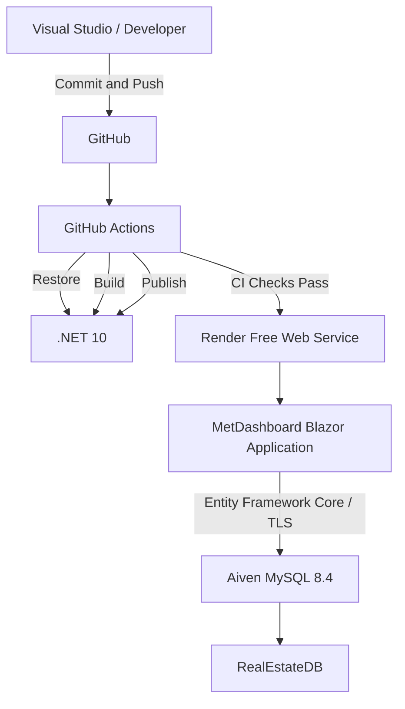

# MetDashboard

MetDashboard is a cloud-connected real estate property management dashboard built using **.NET 10**, **Blazor**, **Entity Framework Core**, **Radzen Blazor**, and **MySQL**.

The application provides a central interface for managing properties, owners, tenants, leases, payments, and maintenance requests.

The project also demonstrates practical DevOps concepts including source control, cloud database hosting, containerised deployment, CI/CD with GitHub Actions, secrets management, troubleshooting, and automated deployment.

---

## Live Application

MetDashboard is deployed using **Render Free Web Service**.

**Live site:**  
https://metdashboard.onrender.com

> The Render Free tier may spin down after a period of inactivity. The first request after inactivity can therefore take additional time while the service starts.

---

## Project Objectives

The main objectives of MetDashboard were to:

- Build a functional real estate management dashboard.
- Connect a .NET application to a MySQL database.
- Provide CRUD functionality for key property management records.
- Add business validation and error handling.
- Store the production database in the cloud.
- Secure database credentials.
- Store application code in GitHub.
- Create an automated CI/CD pipeline.
- Deploy the application to a public cloud hosting service.
- Document troubleshooting and deployment decisions.

---

## Architecture

The final solution uses the following architecture:



### Application flow

```text
Developer
    ↓
GitHub Repository
    ↓
GitHub Actions CI
    ↓
Restore → Build → Publish
    ↓
CI checks pass
    ↓
Render automatic deployment
    ↓
.NET 10 Blazor application
    ↓
Entity Framework Core
    ↓
Aiven MySQL
    ↓
RealEstateDB
```

---

## Technology Stack

| Technology | Purpose |
|---|---|
| .NET 10 | Application framework |
| ASP.NET Core | Server-side web application |
| Blazor Web App | Interactive dashboard UI |
| Radzen.Blazor | UI components |
| Entity Framework Core 10 | Database ORM |
| MySql.EntityFrameworkCore | MySQL EF Core provider |
| MySQL 8.4 | Relational database |
| Aiven | Cloud MySQL hosting |
| Render | Application hosting |
| Docker | Application container deployment |
| Git | Source control |
| GitHub | Remote source repository |
| GitHub Actions | CI pipeline |
| Visual Studio | Development environment |
| MySQL Workbench | Database administration |

---

## Main Dashboard

The dashboard provides an overview of the property management system and displays information retrieved directly from the cloud-hosted `RealEstateDB` database.

The dashboard provides access to the major areas of the application:

- Properties
- Owners
- Tenants
- Leases
- Payments
- Maintenance Requests

The application uses Blazor interactive server components, allowing the user interface to communicate directly with server-side application logic.

---

## Property Management

The Properties section supports full CRUD functionality.

Users can:

- View properties.
- Add properties.
- Edit existing properties.
- View detailed property information.
- Delete properties where database relationships allow it.
- View property ownership.
- View leases associated with a property.
- View payments.
- View maintenance requests.

Property deletion is protected where related records such as leases, maintenance requests, or ownership records exist.

---

## Owner Management

The Owners section allows users to:

- View owners.
- Add owners.
- Edit owner information.
- Delete owners when they are not linked to properties.
- Assign owners to properties.
- Specify ownership percentages.
- Edit property ownership.
- Remove property ownership records.

This uses the `propertyowner` relationship table in the MySQL database.

---

## Tenant Management

The Tenants section supports:

- Viewing tenants.
- Adding tenants.
- Editing tenant information.
- Deleting tenants when no related lease or maintenance records prevent deletion.

Tenant information can then be associated with leases and maintenance requests.

---

## Lease Management

The Lease module allows users to:

- Create leases.
- Edit leases.
- View lease details.
- Terminate active leases.

The application preserves historical lease information rather than deleting terminated leases.

### Lease validation

Business validation prevents overlapping active leases for the same property.

For example, if a property already has an active lease covering a particular date range, another active lease cannot be created for an overlapping period.

---

## Payment Management

The Payments section allows users to:

- Record payments.
- Edit payment records.
- Delete payments where database rules allow it.
- Associate payments with leases.
- Record the employee who received the payment.

### Payment validation

Payment dates must fall within the start and end dates of the selected lease.

This prevents invalid payments being recorded against dates outside the relevant tenancy period.

---

## Maintenance Management

Maintenance requests can be:

- Created.
- Edited.
- Assigned to properties.
- Associated with tenants.
- Assigned to employees.
- Marked as Open.
- Marked as In Progress.
- Marked as Completed.

When a maintenance request is completed, the completion date is stored.

### Maintenance validation

The application validates that a tenant selected for a maintenance request has an active lease for the selected property.

It also validates completion dates and prevents invalid maintenance status combinations.

---

## Database

The application uses:

```text
Database: RealEstateDB
Database Engine: MySQL 8.4
Cloud Provider: Aiven
```

The original database schema was imported into Aiven and then connected to the .NET application through Entity Framework Core.

Example core tables include:

```text
property
owner
tenant
employee
lease
payment
maintenancerequest
propertyowner
paymentaudit
```

---

## Entity Framework Core

Database access is provided through Entity Framework Core.

The database schema was scaffolded into the application using the official MySQL Entity Framework Core provider.

The main database context is:

```text
RealEstateDbContext
```

The application registers an EF Core database context factory and retrieves its connection string through ASP.NET Core configuration.

This keeps database configuration separate from application business logic.

---

## Cloud Database — Aiven

The final production database is hosted using **Aiven MySQL Free**.

Aiven was selected after Azure Database for MySQL provisioning was blocked by Azure subscription and regional capacity restrictions.

The application connects to Aiven using:

- MySQL
- TLS encryption
- Environment-based credentials
- Entity Framework Core

The production database password is not stored in GitHub.

---

## Render Deployment

The application is hosted as a **Render Free Web Service**.

Render builds the application using the project's Dockerfile.

The Docker deployment uses official Microsoft .NET container images:

```text
mcr.microsoft.com/dotnet/sdk:10.0
mcr.microsoft.com/dotnet/aspnet:10.0
```

The application listens on:

```text
0.0.0.0:10000
```

which allows Render to route public requests to the ASP.NET Core application.

---

## Docker

The project contains:

```text
Dockerfile
.dockerignore
```

The Dockerfile uses a multi-stage build.

### Build stage

The build stage:

1. Uses the .NET 10 SDK.
2. Restores NuGet packages.
3. Builds the project.
4. Publishes the application in Release configuration.

### Runtime stage

The runtime stage:

1. Uses the smaller ASP.NET Core .NET 10 runtime image.
2. Copies the published application.
3. Exposes port 10000.
4. Starts `MetDashboard.dll`.

This keeps the final runtime container smaller than using the full SDK image.

---

## Source Control

Git is used for version control and GitHub hosts the remote repository.

The main branch used for the project is:

```text
master
```

Changes are committed locally and pushed to GitHub.

GitHub provides:

- Version history.
- Commit tracking.
- Remote source storage.
- Integration with GitHub Actions.
- Integration with Render.

---

## CI/CD Pipeline

The project uses **GitHub Actions** for Continuous Integration and **Render** for Continuous Deployment.

The workflow is stored in:

```text
.github/workflows/ci-cd.yml
```

### CI process

Whenever code is pushed to `master`, GitHub Actions automatically:

```text
Checkout repository
        ↓
Install .NET 10
        ↓
Restore dependencies
        ↓
Build application
        ↓
Publish application
        ↓
Upload deployment artifact
```

The pipeline validates that the application can successfully build before deployment.

### CD process

Render is configured to deploy:

```text
After CI Checks Pass
```

Therefore the deployment process is:

```text
Code change
    ↓
Git commit
    ↓
Push to GitHub
    ↓
GitHub Actions starts
    ↓
Restore
    ↓
Build
    ↓
Publish
    ↓
CI succeeds
    ↓
Render deploys
    ↓
Live dashboard updated
```

If the GitHub Actions CI check fails, the new version is not automatically deployed.

---

## CI Build Artifact

The GitHub Actions workflow also generates a deployment artifact named:

```text
metdashboard-release
```

This contains the published application output generated by:

```text
dotnet publish
```

The artifact provides evidence that the pipeline has produced a deployment-ready application.

---

## Secrets Management

Sensitive credentials are intentionally excluded from the Git repository.

### Local development

Local database credentials are stored using:

```text
ASP.NET Core User Secrets
```

### Production

Render stores the production connection string using the environment variable:

```text
ConnectionStrings__RealEstateDatabase
```

The application then accesses it using ASP.NET Core configuration.

The Aiven password is therefore not stored in:

- GitHub
- `Program.cs`
- `appsettings.json`
- `Dockerfile`
- README documentation

---

## Error Handling

The application contains user-friendly error handling across:

- List pages.
- Add forms.
- Edit forms.
- Delete operations.
- Property ownership.
- Lease operations.
- Payment operations.
- Maintenance operations.

Detailed errors can be logged on the server while the user interface displays safer and more understandable messages.

---

## Business Validation

Several business rules are implemented within the application.

Examples include:

- Prevent overlapping active leases.
- Validate payment dates against lease periods.
- Validate tenant/property relationships for maintenance requests.
- Validate maintenance completion dates.
- Validate employee IDs used for received payments.
- Prevent deletion when related database records exist.
- Preserve lease history through termination rather than deletion.

These rules help protect database integrity.

---

## Testing

Testing was performed throughout development.

### Functional testing included

- Dashboard loading.
- Property CRUD.
- Tenant CRUD.
- Owner CRUD.
- Lease creation and editing.
- Lease termination.
- Payment creation and editing.
- Maintenance management.
- Property ownership.
- Validation rules.
- Cloud database connectivity.
- Render deployment.
- GitHub Actions pipeline.

### Cloud testing

The application was first tested locally against the Aiven database before being deployed to Render.

This separated database migration problems from application hosting problems.

---

# Troubleshooting

Several real technical problems were encountered and resolved during the project.

These provided useful experience in diagnosing cloud, database, deployment, and CI/CD problems.

---

## Azure MySQL Regional Provisioning

### Problem

Attempts to create Azure Database for MySQL Flexible Server returned:

```text
ProvisionNotSupportedForRegion
```

Multiple Azure regions were tested.

### Investigation

The Azure subscription did not have access to provision the required MySQL service within the selected regions.

### Resolution

Rather than changing the application's database technology, the project was migrated to:

```text
Aiven MySQL Free
```

This allowed the existing MySQL database and Entity Framework code to remain unchanged.

---

## Azure App Service F1 Quota

### Problem

Azure App Service Free F1 could not be created.

Azure showed:

```text
Current Limit (Total VMs): 0
Current Usage: 0
Amount required: 1
```

The App Service quota page showed:

```text
F1 VMs: 0 of 0
```

The subscription was also shown as:

```text
Ineligible for quota adjustment
```

### Resolution

The application hosting platform was changed from Azure App Service to:

```text
Render Free Web Service
```

This allowed the existing server-side Blazor application to remain unchanged.

---

## Aiven Primary Key Import Error

### Problem

Importing the original database into Aiven produced:

```text
ERROR 3750
Unable to create or change a table without a primary key
```

Aiven had:

```text
sql_require_primary_key
```

enabled.

### Resolution

The import session was configured with:

```sql
SET SESSION sql_require_primary_key = 0;
```

The database import then completed successfully.

---

## MySQL Table Name Case Sensitivity

### Problem

The application connected successfully to Aiven but produced errors such as:

```text
Table 'RealEstateDB.property' doesn't exist
```

The original development database ran on Windows, where MySQL table naming behaved case-insensitively.

Aiven runs MySQL on Linux, where the imported table names were case-sensitive.

For example:

```text
Property
```

did not match:

```text
property
```

expected by the Entity Framework mappings.

### Resolution

The cloud database tables were renamed to lowercase.

Examples:

```text
Property → property
Owner → owner
Tenant → tenant
Lease → lease
```

The application then successfully loaded the cloud database.

---

## ActiveLeases View Error

### Problem

MySQL Workbench later reported:

```text
Error Code: 1356
View 'RealEstateDB.ActiveLeases' references invalid table(s) or column(s)
```

### Cause

The `ActiveLeases` view still referenced the original capitalised table names:

```text
Lease
Property
Tenant
```

while the Aiven tables had been renamed:

```text
lease
property
tenant
```

### Resolution

The view was recreated using the lowercase table names.

This repaired the view without modifying the underlying property, tenant, or lease data.

---

## Render Exit Status 139

### Problem

A Render deployment failed with:

```text
Exited with status 139
```

The stack trace referenced:

```text
System.IO.FileSystemWatcher
Microsoft.Extensions.Configuration
```

### Resolution

Configuration file change monitoring was disabled in the Render production environment using:

```text
DOTNET_hostBuilder__reloadConfigOnChange=false
```

The service was redeployed and successfully returned to:

```text
Live
```

The dashboard then became publicly accessible again.

---

## GitHub Actions Verification

The CI workflow was tested successfully.

GitHub Actions confirmed successful execution of:

```text
Checkout repository
Setup .NET 10
Restore dependencies
Build application
Publish application
Upload deployment artifact
```

This confirmed that a clean GitHub-hosted runner could successfully build and publish MetDashboard without relying on the local development machine.

---

## Project Structure

A simplified view of the repository is:

```text
MetDashboard
│
├── .github
│   └── workflows
│       └── ci-cd.yml
│
├── Components
│
├── Data
│   ├── Models
│   └── RealEstateDbContext.cs
│
├── Properties
├── wwwroot
│
├── .dockerignore
├── .gitignore
├── Dockerfile
├── MetDashboard.csproj
├── Program.cs
├── appsettings.json
└── README.md
```

---

## DevOps Practices Demonstrated

This project demonstrates several DevOps practices:

- Git-based source control.
- Remote GitHub repositories.
- Small incremental commits.
- Automated Continuous Integration.
- Automated deployment after CI checks.
- Build artifacts.
- Containerised deployment.
- Environment-based configuration.
- Secrets management.
- Cloud database hosting.
- Cloud application hosting.
- Troubleshooting using deployment logs.
- Database troubleshooting.
- Environment migration.
- Release validation.

---

## Future Improvements

Possible future improvements include:

- Authentication and role-based access control.
- Automated unit and integration testing within GitHub Actions.
- Database migration automation.
- More detailed logging and monitoring.
- Additional dashboard charts.
- Search and filtering improvements.
- Pagination for larger datasets.
- Email notifications for maintenance requests.
- Lease expiry notifications.
- Payment reminders.
- Production-grade paid hosting.
- Database backup automation.
- Improved observability and alerting.

---

## Conclusion

MetDashboard demonstrates the development and deployment of a full-stack property management system using modern .NET and DevOps technologies.

The final solution combines:

```text
.NET 10
Blazor
Radzen
Entity Framework Core
MySQL
Aiven
Docker
Render
GitHub
GitHub Actions
```

The application provides working real estate management functionality while also demonstrating cloud deployment, CI/CD automation, secure configuration, database integration, validation, testing, and real-world troubleshooting.